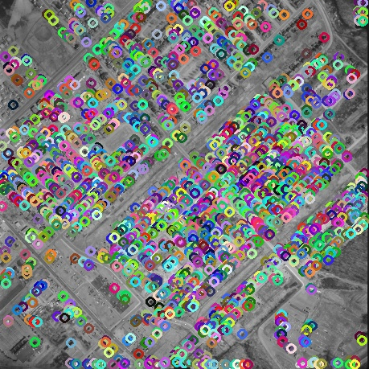
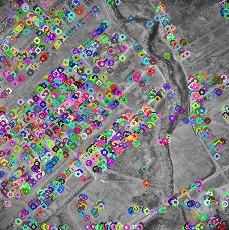
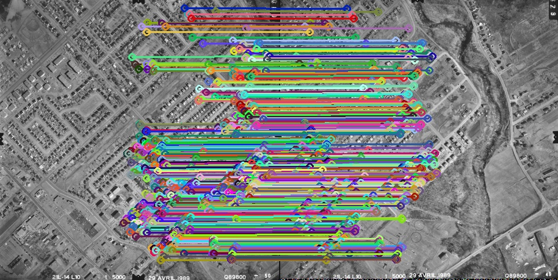
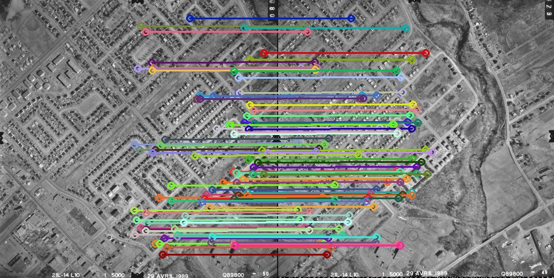
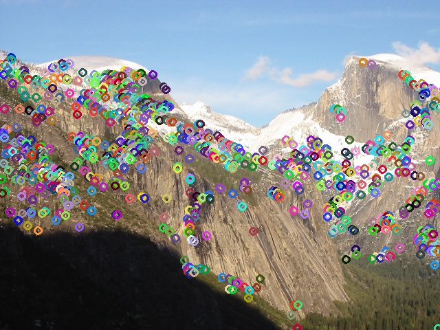
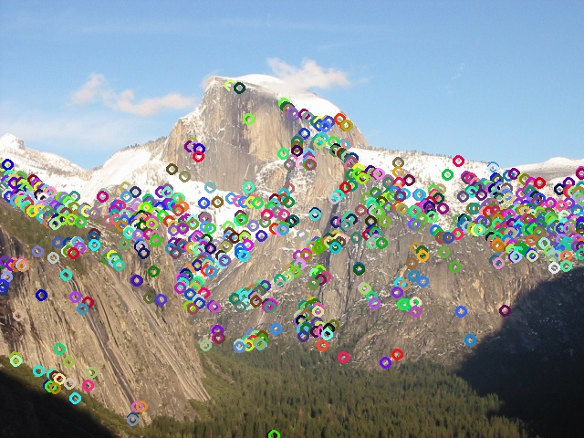
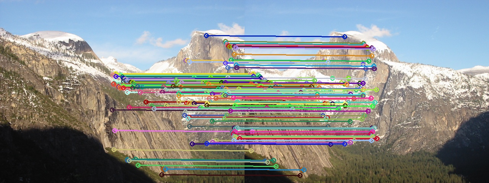

# 基于相关系数和最小二乘的影像匹配

此代码为数字摄影测量的课程代码，由于精力有限，实现了基于相关系数和最小二乘方法的影像匹配。

## 一、说明

程序源代码分为两部分，一部分是`detector`，一部分是`matcher`。其他如`tic_toc`和`progressbar`用于计时和显示进度条。

在`detector`部分，包含了角点检测相关的函数，主要有：Harris算子`HarrisCornerDetect`（OpenCV实现，进行了进一步封装），Moravec算子`MoravecCornerDetect`（自己实现）和SIFT`SIFTCornerDetect`（OpenCV实现，进行了进一步封装）。也包含了用于绘制角点的函数`drawCorners`。

在`matcher`部分，包含了影像匹配的相关类，主要有：相关系数匹配（`CorrelationMatcher`）和最小二乘匹配（`LsqMatcher`），类中可以设定匹配窗口大小和阈值，以及包含了通用的绘制匹配结果的函数`drawMatches`。

### 1.1 相关系数匹配

在相关系数匹配中，实现了两种匹配方式，分别对应`match`方法和`matchImproved`方法。

`match`方法为在参考影像中先提取特征点，然后遍历目标影像对每个特征点通过相关系数匹配（目标影像不进行特征提取），这种匹配方式得到的匹配点较多，但速度很慢。

`matchImproved`方法为在两幅影像中分别提取特征点，然后计算特征点之间的相关系数，这种方式虽然匹配的同名点有所减少（在实际使用中，**匹配点数会减少7倍**），但是速度有显著提升（在实际使用中，**速度会加快1000多倍**）。

### 1.2 最小二乘匹配

在最小二乘匹配中，需要为匹配提供初值，提供的方式可以先进行相关系数匹配，然后将相关系数匹配的结果用于最小二乘匹配，因此最小二乘匹配的结果应该和相关系数匹配的结果相同。区别为：最小二乘匹配的结果为亚像素级别的角点，相对于相关系数匹配的整像素角点更精确。

在我的实际做法中，将相关系数匹配的阈值设置为0.85作为最小二乘匹配的初值。在最小二乘匹配中，设定最大迭代次数为50次，停止迭代的相关系数阈值设置为0.95。也就是在50次的迭代次数中，如果某一次迭代使相关系数大于0.95了就退出迭代作为最后匹配的结果，否则如果50次迭代结束，就去50次中相关系数最高的那次迭代作为最后的结果。

在最小二乘匹配处理中，部分靠近边界的匹配点由于计算导数时会出现问题，会被直接忽略，所以最小二乘匹配的结果会略小于相关系数匹配。

## 二、使用

在使用代码前，需要自己在代码中更改两幅匹配影像路径、角点检测时的相关参数、匹配时窗口大小和阈值等。

代码依赖OpenCV和Eigen，编写时使用的OpenCV版本为3.4.14。

代码在Ubuntu 20.04下进行编写和测试，使用方法：

```bash
cd ImageMatch               // 切换到代码路径下
mkdir build && cd build
cmake ..    
make                        // 编译代码
./ImageMatch                // 运行程序
```

## 三、效果展示

### 3.1 影像LOR50和LOR49

#### （1）使用Moravec算子提取角点，阈值为700





#### （2）相关系数匹配结果

##### ① 通过`match`进行匹配

```
使用Moravec算子进行角点检测，阈值设置为：700
特征点提取用时：0.0308893秒
图像1中特征点数量：1914
图像2中特征点数量：1424

开始相关系数匹配：
[######################################################################] 100% 1122.28s
相关系数匹配窗口大小：25        阈值：0.85
相关系数匹配用时：1122.28秒
相关系数匹配到同名点：505

最小二乘匹配窗口大小：5 阈值：0.95
最小二乘匹配用时：0.124686秒
最小二乘匹配到同名点：504

运行结束!
```



##### ② 通过`matchImproved`进行匹配

```
用Moravec算子进行角点检测，阈值设置为：700
特征点提取用时：0.0400729秒
图像1中特征点数量：1914
图像2中特征点数量：1424

开始相关系数匹配：
[######################################################################] 100% 8.024s
相关系数匹配窗口大小：25        阈值：0.85
相关系数匹配用时：8.02553秒
相关系数匹配到同名点：84

最小二乘匹配窗口大小：5 阈值：0.95
最小二乘匹配用时：0.0351529秒
最小二乘匹配到同名点：83

运行结束!
```




| 左片X | 左片Y | 右片X | 右片Y | 相关系数 |
| ----- | ----- | ----- | ----- | -------- |
| 313   | 30    | 120   | 30    | 0.869588 |
| 232   | 43    | 40    | 43    | 0.867917 |
| 403   | 46    | 210   | 46    | 0.880097 |
| 240   | 52    | 48    | 52    | 0.854946 |
| 435   | 87    | 243   | 87    | 0.896972 |
| 412   | 98    | 220   | 98    | 0.852343 |
| 250   | 103   | 60    | 102   | 0.852411 |
| 227   | 113   | 37    | 112   | 0.863003 |
| 253   | 112   | 63    | 111   | 0.860334 |


#### （3） 最小二乘匹配结果

下面的结果在上面使用`matchImproved`方法作为初值后，使用最小二乘匹配得到。

| 左片X | 左片Y | 右片X   | 右片Y   | 相关系数 |
| ----- | ----- | ------- | ------- | -------- |
| 313   | 30    | 119.982 | 29.6661 | 0.957559 |
| 232   | 43    | 40.7976 | 42.7993 | 0.908788 |
| 240   | 52    | 49.1067 | 50.0887 | 0.936198 |
| 435   | 87    | 242.522 | 87.4051 | 0.96809  |
| 412   | 98    | 220.815 | 97.0586 | 0.958801 |
| 250   | 103   | 59.2226 | 101.753 | 0.959226 |
| 227   | 113   | 36.9947 | 112.172 | 0.927843 |
| 253   | 112   | 62.5936 | 111.545 | 0.927089 |
| 255   | 113   | 64.3184 | 112.597 | 0.968071 |
| 251   | 116   | 58.4239 | 116.155 | 0.901486 |


### 3.2 其他影像

#### （1）使用Moravec算子提取角点，阈值为700





#### （2）相关系数匹配结果

##### ① 通过`match`进行匹配

```
使用Moravec算子进行角点检测，阈值设置为：700
特征点提取用时：0.03976秒
图像1中特征点数量：965
图像2中特征点数量：805

开始相关系数匹配：
[######################################################################] 100% 863.908s
相关系数匹配窗口大小：25        阈值：0.85
相关系数匹配用时：863.909秒
相关系数匹配到同名点：382

最小二乘匹配窗口大小：5 阈值：0.95
最小二乘匹配用时：0.0773421秒
最小二乘匹配到同名点：376

运行结束!
```


##### ② 通过`matchImproved`进行匹配

```
使用Moravec算子进行角点检测，阈值设置为：700
特征点提取用时：0.0375328秒
图像1中特征点数量：965
图像2中特征点数量：805

开始相关系数匹配：
[######################################################################] 100% 2.502s
相关系数匹配窗口大小：25        阈值：0.85
相关系数匹配用时：2.50518秒
相关系数匹配到同名点：139

最小二乘匹配窗口大小：5 阈值：0.95
最小二乘匹配用时：0.0415968秒
最小二乘匹配到同名点：138

运行结束!
```



